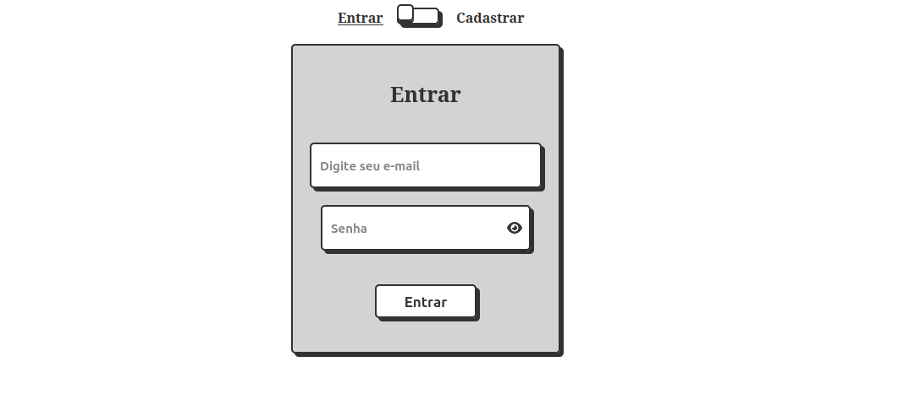
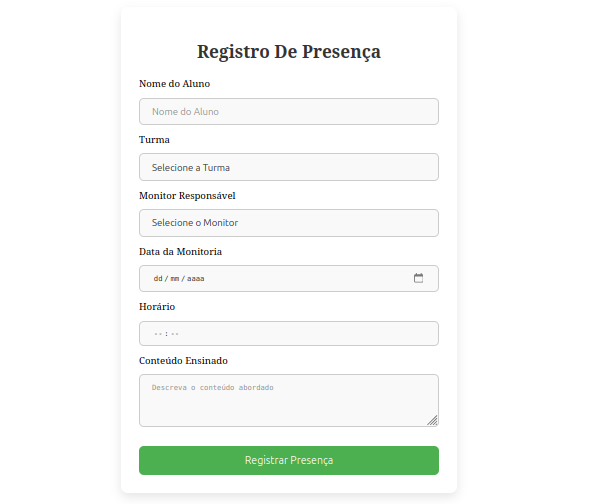
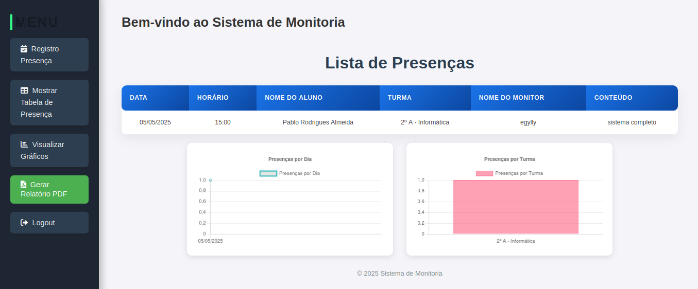

# 📚 Sistema de Registro de Presenças na Monitoria

Sistema web completo para registrar a presença dos alunos durante sessões de monitoria, com painel do monitor, autenticação, geração de relatórios em PDF e visualização de dados.

## 👨‍💻 Desenvolvido por
**Pablo Rodrigues Almeida**  
Curso Técnico em Informática para Web  
Último ano do Ensino Médio

---

## 🚀 Tecnologias Utilizadas

- **Node.js** com **Express**
- **MySQL** com integração via `mysql2`
- **PDFKit** para geração de relatórios
- **JavaScript**, **HTML5**, **CSS3**
- **Docker** e `docker-compose`
- **Chart.js** (gráficos)
- Autenticação com **express-session**

---

## 📁 Estrutura de Pastas

```

monitoria/
├── banco.sql                   # Script SQL do banco de dados
├── docker-compose.yml         # Orquestrador do ambiente Docker
├── Dockerfile                 # Dockerfile raiz
├── README.md
└── server/
├── config/db.js           # Conexão com MySQL
├── Dockerfile             # Dockerfile do backend
├── models/presenca.js     # Modelo da tabela presenca
├── public/                # Arquivos estáticos
│   ├── css/
│   └── js/
├── routes/presenca.js     # Rotas da API
├── server.js              # Backend principal
└── views/                 # Páginas HTML

````

---

## ⚙️ Como executar o projeto

### ✅ Executando com Docker

1. Clone o repositório:
```bash
git clone https://github.com/seuusuario/monitoria.git
cd monitoria
````

2. Inicie os containers:

```bash
docker-compose up --build
```

3. O sistema estará acessível em:

```
http://localhost:3000
```

4. Acesse o MySQL com:

* Host: `localhost`
* Porta: `3306`
* Usuário: `root`
* Senha: `123456`
* Banco: `monitoria`

> Use o arquivo `banco.sql` para importar as tabelas e dados iniciais.

---

## 📋 Funcionalidades

* ✅ Registro de presença dos alunos (nome, turma, conteúdo, horário)
* ✅ Tela do monitor com controle de sessões
* ✅ Geração de relatório em PDF
* ✅ Listagem das presenças
* ✅ Gráficos de dados com Chart.js
* ✅ Login com autenticação de sessão
* ⚙️ (em desenvolvimento) Filtros de busca, exportação em CSV, etc.

---

## 💡 Ideias futuras

* Exportar relatórios em CSV
* Tela para gerenciar monitores
* Filtro por data, turma, conteúdo
* Dashboard com estatísticas de presença
* Upload de arquivos e anotações

---

## 📷 Prints do Sistema

1. Tela de Login:


2. Tela de Registro de Presença:


3. Painel de Monitoria:


---

## 📜 Licença

Este projeto é de uso acadêmico e livre para aprendizado.

---

## 🤝 Contato

Se quiser colaborar, corrigir bugs ou sugerir melhorias:

* GitHub: [github.com/Kingnike1](https://github.com/Kingnike1)
* Email: [pabloalmeidathe1@email.com](mailto:pabloalmeidathe1@email.com)


